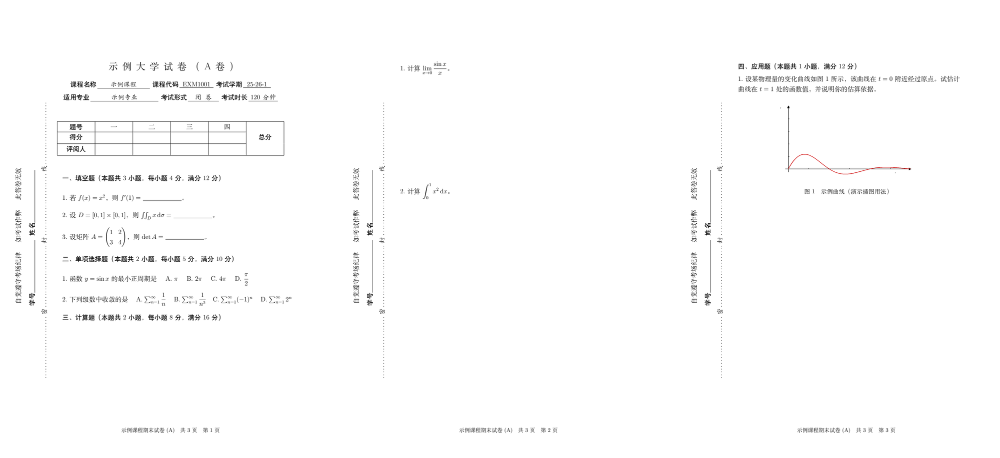

# 通用中文试卷 LaTeX 模板（东南大学试卷版式）

[](https://github.com/sunflower070203/SEU-Test-Latex-Template/actions/workflows/build.yml)
[](LICENSE)

一个**通用的中文期末考试卷 LaTeX 模板**：版式取自一份真实的东南大学试卷（由 PDF 逆向还原，
页面几何、字号、表格线、密封线坐标都按原卷实测得到），但模板本身不带任何题目，
任何高校、任何课程都能直接套用。

- **默认输出空骨架**：只有抬头、信息栏、评分表和各栏占位，一道题都没有；
- **一个开关看完整示例**：把 `main.tex` 里的 `\showexamplefalse` 改成 `\showexampletrue`，
  立刻得到一份含填空/选择/计算/应用题的示例卷（含插图、多页）；
- **页数自动增长**：加题目就自动加页，页脚「共 X 页 第 Y 页」、左侧密封线每页自动出现。

## 效果预览

示例卷（3 页，虚构内容）—— 用 `\showexampletrue` 编译所得，文件见
[`preview/sample-exam.pdf`](preview/sample-exam.pdf)：



## 功能特性

- A4 / 12pt，正文**宋体**、栏目与表格标题**黑体**、填写内容**楷体**，数学公式为 Computer Modern（原卷风格）；
- 试卷标题大字号 + 自动字距，即「东 南 大 学 试 卷 （A 卷）」那种效果；
- 抬头信息栏：`课程名称 / 课程代码 / 考试学期 / 适用专业 / 考试形式 / 考试时长`，带下划线填空；
- 评分表：`题号 | 一 | 二 | … | 总分`，`得分 / 评阅人` 两行，「总分」列自动跨行合并，栏数可调；
- 大题自动编号（`一、` `二、` `三、` …）、小题自动编号（`1.` `2.` …），每栏小题号自动重置；
- 答题留白：`\examanswerspace{7cm}` 放在题干之后，逐题留出书写空间（含最后一题）；
- 左侧竖排**密封线**：考场纪律提示 + 学号/姓名 + 点线「密 封 线」，逐页出现在背景层；
- 插图：内置 `\examfigure` 命令（也支持标准 `figure` 环境），图片放 `figures/` 即可；
- 页脚：`试卷名　共 X 页　第 Y 页`，总页数自动统计，多页不掉页码；
- 多页友好：`\newpage` 控制大题起始页，长题目自动断开。

## 目录结构

```
SEU-Test-Latex-Template/
├── main.tex                    # 入口文件（编译目标）：默认空模板，\showexampletrue 切示例
├── example-exam.tex            # 示例内容（虚构题目），由 main.tex 引入，不能单独当主文件编译
├── exampaper.cls               # 模板本体：版式、字体、评分表、密封线、插图命令、页脚
├── latexmkrc                   # latexmk 配置（走 XeLaTeX）
├── Makefile                    # 一键编译：make / make quick / make clean / make cleanall
├── .github/workflows/build.yml # CI：每次 push 自动编译并上传 PDF 产物
├── figures/
│   └── sample-figure.png       # 示例插图（演示 \examfigure 用法）
├── preview/
│   ├── sample-exam.pdf         # 示例卷编译结果（3 页）
│   ├── sample-exam-preview.png # 上面那张三联预览图
│   ├── sample-page1.png        # 示例卷第 1 页
│   └── layout.svg              # 版式示意图（按模板参数绘制，非编译结果）
├── tools/
│   └── make_preview.py         # 生成 layout.svg 的脚本（可选，不参与编译）
├── LICENSE                     # MIT
└── .gitignore
```

**各文件职责**：`main.tex` 是唯一的编译入口；`example-exam.tex` 是**内容文件**（不含
`\documentclass`），被 `main.tex` 用 `\input` 引进来；`exampaper.cls` 集中了全部版式定义，
想改字号、页边距、密封线位置都改它。

## 环境要求

| 项目 | 要求 |
| --- | --- |
| 编译器 | **XeLaTeX**（推荐）或 LuaLaTeX；**中文不要用 pdfLaTeX** |
| TeX 发行版 | TeX Live 2020+ / MiKTeX 21+ / MacTeX |
| 宏包 | `ctex`、`geometry`、`amsmath`、`graphicx`、`array`、`tabularx`、`multirow`、`lastpage`、`eso-pic`、`fancyhdr`、`iftex`（随发行版自带） |
| 中文字体 | Windows 自带即可；macOS / Linux 见下文「字体」 |

> 模板内置引擎检测：万一用 pdfLaTeX 编译，会直接报
> 「本模板包含中文，必须使用 XeLaTeX 或 LuaLaTeX 编译」，而不是抛出一串看不懂的错误。

## 快速开始（本地）

```bash
git clone https://github.com/sunflower070203/SEU-Test-Latex-Template.git
cd SEU-Test-Latex-Template

make            # 等价于 latexmk -xelatex main.tex（自动跑两遍）
# 或者手动：
xelatex main.tex && xelatex main.tex
```

编出来的就是空模板（1 页）；想看完整示例，把 `main.tex` 里这一行的注释开关打开：

```latex
\showexamplefalse      % ← 改成 \showexampletrue 看完整示例
```

然后 `make` 或 `make MAIN=example-exam` 即可。

## 在 Overleaf 上使用

### 方式一：上传 zip（最常用）

1. 在本仓库页面点 **Code → Download ZIP**，得到 `SEU-Test-Latex-Template-main.zip`；
2. 打开 Overleaf 首页 → **New Project → Existing project (.zip)**，上传该 zip；
3. **把编译器改成 XeLaTeX**：左下角 **Settings → Compiler → Compiler 选 `XeLaTeX`**；
4. 点 **Recompile**，完成。

> ⚠️ 第 3 步不能省。Overleaf 新建项目的默认编译器是 **pdfLaTeX**，中文会报
> `CTeX fontset 'fandol' is unavailable` + `Package CJK Error: Invalid character code`。
> 实测 `latexmkrc` 和 `% !TEX program = xelatex` 这类写法**都压不过** Overleaf 的项目级设置，
> 必须在 Settings 里手动选一次（每个项目只需设置一次）。

### 方式二：从 GitHub 导入

Overleaf 首页 → **New Project → Import from GitHub**，选择本仓库即可，导入后同样要按上面第 3 步切换编译器。

### 方式三：直接复制文件

已有项目的话，把 `exampaper.cls`、`main.tex`、`example-exam.tex`（以及 `figures/`）
拖进项目文件树，然后同样把编译器切成 XeLaTeX。

### 几点提示

- **必须编译两遍**：页脚「共 X 页」靠 `lastpage` 统计，第二遍才准确（Overleaf 默认就会跑两遍）；
- **字体**：Overleaf 是 Linux 环境，ctex 会自动用 Fandol 字体集，一般无需干预；
  若提示找不到字体，把 `\documentclass[12pt,a4paper]{exampaper}` 改成
  `\documentclass[fontset=fandol]{exampaper}`；
- **主文件必须是 `main.tex`**：`example-exam.tex` 是内容文件，被设成主文件会编译失败
  （模板会给出明确提示）。

## 出一份自己的卷子

改 `main.tex` 就行，骨架长这样：

```latex
\documentclass[12pt,a4paper]{exampaper}
\examname{〈试卷名〉}                       % 页脚左侧

\begin{document}
\examtitle{〈学校名〉试卷（A 卷）}           % 大标题，自动加字距

\begin{center}                             % 抬头信息栏
  \examfield[3.4cm]{课程名称}{〈课程名称〉}\hspace{0.4em}%
  \examfield[2.2cm]{课程代码}{〈课程代码〉}\hspace{0.4em}%
  \examfield[1.8cm]{考试学期}{〈20xx-xx-x〉}\\[0.4em]
  \examfield[4.4cm]{适用专业}{〈适用专业〉}\hspace{0.4em}%
  \examfield[2.0cm]{考试形式}{闭\hspace{0.5em}卷}\hspace{0.4em}%
  \examfield[1.9cm]{考试时长}{〈150〉\hspace{0.4em}分钟}
\end{center}

\examscoretable[6]                         % 评分表，6 = 评阅栏数

\examsection{填空题（本题共 ? 小题，每小题 ? 分，满分 ? 分）}
\begin{examquestions}
  \examquestion 〈题干〉
\end{examquestions}

\examsection{计算题（本题共 ? 小题，每小题 ? 分，满分 ? 分）}
\begin{examquestions}[0pt]                 % 0pt：题目紧排，答题空间逐题显式留出
  \examquestion 〈题干〉
  \examanswerspace{7cm}                    % 本题 7cm 答题空间（最后一题同样生效）
\end{examquestions}

\end{document}
```

### 插图

`graphicx` 已加载，图片放在 `figures/` 目录下：

```latex
\examfigure[0.6\textwidth]{图题}{figures/sample-figure.png}   % 一行插图 + 自动图号
```

需要更自由的图文排版，直接用标准 `figure` 环境：

```latex
\begin{figure}[htbp]
  \centering
  \includegraphics[width=0.5\textwidth]{figures/your-image.png}
  \caption{图题}\label{fig:your}
\end{figure}
```

png / jpg / pdf 都能直接插入；svg 请先转成 pdf。表格用标准 `tabular`
（`array`、`tabularx`、`multirow` 已加载），放在题干里即可。

### 多页试卷

页数不用手写：**内容多就自动加页**（空骨架 1 页，示例 3 页）。以下元素每页自动都有：
页脚「试卷名 共 X 页 第 Y 页」、左侧竖排密封线；抬头与评分表只在第 1 页。

| 需求 | 写法 |
| --- | --- |
| 让某道大题整体挪到下一页开头 | 在 `\examsection{...}` 前加 `\newpage` |
| 长题目自动断开 | 不用管，LaTeX 会在行间自动分页 |
| 加/减答题空间 | 调 `\examanswerspace{7cm}` 里的长度 |
| 整份试卷不要密封线 | 导言区写 `\examsidebarfalse` |

三个容易踩的点：

1. **必须编译两遍**，否则页脚总页数是上一轮的；
2. **单处答题留白别超过一页**：当前页只剩 3cm 而你要 7cm 时，空白会被切到下一页，
   看起来像「答题位置不见了」。对策：调小间距，或在该大题前 `\newpage`。
3. **不要用 `\begin{examquestions}[7cm]` 留答题空间**（这是最常见的误解）。
   该参数是 `\parskip`（段间距），只在段落**之间**生效，实际效果是
   「留白跑到第一题之前、最后一题之后反而没有」。请改用 `\examanswerspace{7cm}`。

## 命令速查

| 命令 | 说明 |
| --- | --- |
| `\examtitle{...}` | 试卷大标题：居中、`\Large`、字符自动加字距 |
| `\examname{...}` | 页脚中显示的试卷名 |
| `\examfield[宽]{项目名}{内容}` | 抬头信息栏的一项；宽度即下划线长度，内容留空得到空白横线，内容用楷体 |
| `\examscoretable[大题数]` | 评分表，默认 6 个评阅格，宽度自动撑满版心 |
| `\examsection{栏目标题}` | 大题标题，自动加「一、」「二、」…，并把小题号重置为 1 |
| `\begin{examquestions}[题间距]` … `\end{examquestions}` | 小题区；参数是**题间距**，默认 13pt（不是答题空间） |
| `\examanswerspace{长度}` | 在某题后留出答题空间（最后一题同样生效）；配合 `[0pt]` 使用 |
| `\examquestion` | 输出「1.」「2.」…（每道大题内重新计数），别名 `\question` |
| `\begin{examproblem}` … `\end{examproblem}` | 单个大题（不自动编号小题） |
| `\examfigure[宽]{图题}{图片文件}` | 插入一张图并自动给图号 |
| `\examsidebarfalse` | 导言区使用，关闭左侧密封线 |

## 版式参数

参数集中在 `exampaper.cls` 的注释块里，直接改即可：

| 参数 | 默认 | 含义 |
| --- | --- | --- |
| `geometry` | `top=4cm, bottom=2.5cm, left=3.7cm, right=2.6cm` | 页边距；左边距较大是为密封线留位置 |
| `\parindent` | `0.8em`（≈9.6pt） | 段落首行缩进，也用于大题标题位置 |
| `\examindent` | `0.8em` | 题目整体左缩进（换行后与首行左端对齐） |
| `\examziju` | `0.46em` | 试卷标题字距 |
| `\examitemsep` | `13pt` | `examquestions` 的默认题间距 |
| `\examsectionpreskip` / `\examsectionpostskip` | `1.2em` / `0.4em` | 大题标题上下间距 |
| `\exam@warn` `\exam@id` `\exam@seal` | — | 密封线三行竖排文字的内容 |
| `\exam@side` 里的 `\put(x,y)` | `(27.9,286) (53.1,283.5) (76,145.5)` | 密封线三行文字坐标，单位 pt，原点在页面左下角 |

## 自动编译（GitHub Actions）

仓库自带 CI（[`.github/workflows/build.yml`](.github/workflows/build.yml)）：**每次 push 到 `main`
（或发起 Pull Request、手动触发）都会自动用 XeLaTeX 编译，并把 PDF 作为产物保存**。
页首那个 `Build PDF` 徽章就是它的状态。

- 查看构建结果：仓库页 **Actions → Build PDF**；
- 下载 PDF：进入某次运行，页面底部 **Artifacts → `exam-paper-pdf`**，里面有
  `template-blank.pdf`（空模板）和 `example-filled.pdf`（示例卷，3 页）；
- 手动触发：Actions → Build PDF → **Run workflow**。

CI 里做的事：先编译 `main.tex` 得到空模板，再用
`sed 's/\\showexamplefalse/\\showexampletrue/' main.tex` 生成示例入口并编译，
所以两种版本的 PDF 都会被构建一遍——这等于每次提交都帮你做了一次编译验证。

> 本地没有装 TeX 的同学，可以直接下载 Actions 里的 Artifacts 取用编译好的 PDF。

## 常见问题

**页脚显示「共 ?? 页」或页数不对** —— 编译两遍即可（`lastpage` 需要这一轮才知道总页数）。

**提示字体缺失（XXX font not found）** —— 当前系统的 ctex 字体集不匹配，指定即可：

```latex
\documentclass[fontset=windows]{exampaper}  % Windows：宋体/黑体/楷体
\documentclass[fontset=mac]{exampaper}      % macOS：Songti SC 等
\documentclass[fontset=ubuntu]{exampaper}   % Linux（需装 fonts-noto-cjk 等）
\documentclass[fontset=fandol]{exampaper}   % 随 TeX Live 附带，任何平台都能编
```

**Overleaf 报 `CTeX fontset 'fandol' is unavailable` / `Package CJK Error`** ——
编译器还是 pdfLaTeX，去 Settings → Compiler 选 XeLaTeX。

**提示 `Overfull \hbox`（文本超出版心）** —— 抬头信息栏或题干写得太宽，
减小 `\examfield` 的宽度参数或换行即可。

**密封线不在左侧 / 跑到别处** —— 密封线画在 `eso-pic` 背景层上，用绝对坐标控制（原点为页面
左下角）。改纸张或大幅改页边距时需要相应调整 `\exam@side` 里的三个 `\put` 坐标。

**想换成自己学校的名字** —— 直接改 `\examtitle{...}`；需要两行标题可以自己加换行。

## 致谢与参考

- 版式来自一份真实的东南大学期末考试卷 PDF，通过逐字符坐标解析逆向还原（不包含任何原卷题目内容）；
- README 的组织方式参考了 [WCY-dt/SEU-Master-LaTeX-Template](https://github.com/WCY-dt/SEU-Master-LaTeX-Template)。

## 许可

[MIT License](LICENSE)。欢迎自由修改、分发；如果对版式做了改进，欢迎提 PR。
