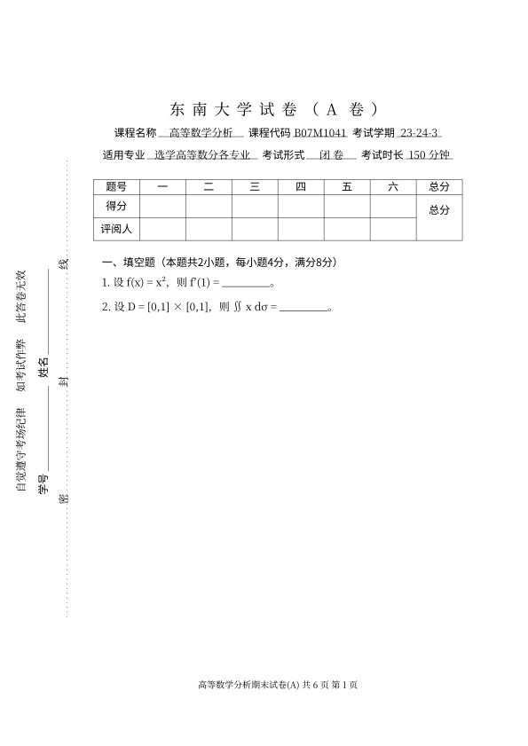

# exampaper —— 通用中文试卷 LaTeX 模板

一个可直接套用的中文试卷（期末考试卷）LaTeX 模板，提供了中文试卷常见的全部版式要素：

- A4 / 12pt，正文**宋体**、栏目与表格标题**黑体**、填写内容**楷体**，数学公式为 Computer Modern（原卷风格）；
- 试卷标题大字号 + 自动字距（`东 南 大 学 试 卷 （A卷）` 那种效果）；
- 抬头信息栏：`课程名称 / 课程代码 / 考试学期 / 适用专业 / 考试形式 / 考试时长`，带下划线填空；
- 评分表：`题号 | 一 | 二 | … | 总分`，`得分 / 评阅人` 两行，「总分」列自动跨行合并；
- 大题自动编号（`一、` `二、` `三、` …），小题自动编号（`1.` `2.` …），每题后可留答题空间；
- 左侧竖排**密封线**（考场纪律提示 + 学号/姓名 + 点线「密 封 线」），逐页出现在背景层；
- 页脚：`试卷名   共 X 页   第 Y 页`。

版式参数来自一份真实的期末试卷（A4，正文宽 14.70cm，页顶留白 4cm），抽取时保留了页面几何、
字号、行距、表格线与密封线的实际坐标，因此外观与原卷基本一致。**题目内容不在模板范围内**，
请自行填写。

## 效果预览

`preview/layout.svg` 是按模板参数绘制的版式示意图（非编译结果，仅供确认版式）：



## 环境要求

| 项目 | 要求 |
| --- | --- |
| 编译器 | **XeLaTeX**（推荐）或 LuaLaTeX；中文不建议用 pdfLaTeX |
| TeX 发行版 | TeX Live 2020+ / MiKTeX 21+ / MacTeX（MacTeX 亦可） |
| 宏包 | `ctex`、`geometry`、`amsmath`、`graphicx`、`array`、`tabularx`、`multirow`、`lastpage`、`eso-pic`、`fancyhdr`（前两者之外都是常见宏包，随发行版自带） |
| 中文字体 | Windows 自带即可；macOS / Linux 见下文「字体」 |

## 编译

```bash
# 推荐：连续编译两遍，页脚「共 X 页」才正确
xelatex main.tex
xelatex main.tex

# 或者
latexmk -xelatex main.tex
```

在 Overleaf 上使用：`Menu → Compiler` 选择 `XeLaTeX`；若提示找不到字体，
把 `\documentclass[12pt,a4paper]{exampaper}` 换成 `\documentclass[fontset=fandol]{exampaper}`。

## 文件说明

```
exampaper.cls          模板本体（版式、字体、评分表、密封线、页脚全部在这里）
main.tex               试卷示例 / 骨架，改这份文件即可出新卷
preview/layout.svg     版式示意图
tools/make_preview.py  生成上面这张示意图的脚本（可选，不参与编译）
LICENSE                MIT
```

## 快速开始

抄 `main.tex` 的结构即可，最小例子：

```latex
\documentclass[12pt,a4paper]{exampaper}
\examname{高等数学分析期末试卷(A)}   % 页脚左侧文字

\begin{document}

\examtitle{东南大学试卷（A卷）}        % 大标题，自动加字距

\begin{center}                        % 抬头信息栏
  \examfield[3.4cm]{课程名称}{高等数学分析}\hspace{0.4em}%
  \examfield[2.2cm]{课程代码}{B07M1041}\\[0.4em]
  \examfield[4.4cm]{适用专业}{选学高等数分各专业}\hspace{0.4em}%
  \examfield[1.9cm]{考试时长}{150\hspace{0.4em}分钟}
\end{center}

\vspace{0.8em}
\examscoretable[6]                    % 评分表，6 = 评阅栏数

\examsection{填空题（本题共2小题，每小题4分，满分8分）}
\begin{examquestions}
  \examquestion 设 $f(x)=x^{2}$，则 $f'(1)=\underline{\hspace{2cm}}$。
  \examquestion 设 $D=[0,1]\times[0,1]$，则 $\displaystyle\iint_{D}x\,\mathrm{d}\sigma=$\underline{\hspace{2cm}}。
\end{examquestions}

\examsection{计算下列各题（本题共2小题，每小题7分，满分14分）}
\begin{examquestions}[9cm]            % 9cm = 每题后留出的答题空间
  \examquestion 求函数 $z=x^{2}+y^{2}$ 在 $D=\{(x,y)\mid x^{2}+y^{2}\le1\}$ 上的最值。
  \examquestion 计算 $\displaystyle\oint_{L}(x+y)\,\mathrm{d}s$，其中 $L$ 为圆周 $x^{2}+y^{2}=2x$。
\end{examquestions}

\examsection{（本题满分8分）}          % 只有一道大题、无小题编号时这样写
\begin{examproblem}
  已知曲线 $L$ 为闭曲线 …，求曲线积分 $\displaystyle\oint_{L}P\,\mathrm{d}x+Q\,\mathrm{d}y$。
\end{examproblem}

\end{document}
```

## 命令速查

| 命令 | 说明 |
| --- | --- |
| `\examtitle{...}` | 试卷大标题：居中、`\Large`、字符自动加字距 |
| `\examname{...}` | 页脚中显示的试卷名，如「高等数学分析期末试卷(A)」 |
| `\examfield[宽]{项目名}{内容}` | 抬头信息栏的一项。宽度即下划线长度；内容留空 `{}` 得到空白横线；内容为楷体 |
| `\examscoretable[大题数]` | 评分表。参数默认 6，即 6 个评阅格；表格宽度自动撑满版心 |
| `\examsection{栏目标题}` | 大题标题，自动加「一、」「二、」…；同时把小题编号重置为 1 |
| `\begin{examquestions}[题间距]` … `\end{examquestions}` | 带编号的小题区。默认题间距 `\examitemsep`（13pt，填空题用）；给如 `[9cm]` 即每题后留出答题空间 |
| `\examquestion` | 输出「1.」「2.」…（每道大题内重新计数） |
| `\begin{examproblem}` … `\end{examproblem}` | 不带编号的单个大题（「三、（本题满分8分）」这类） |
| `\examsidebarfalse` | 放在导言区，关闭左侧密封线 |
| `\question` | `\examquestion` 的短别名（仅当 `\question` 未被占用时定义） |

## 版式参数

参数集中在 `exampaper.cls` 的注释块里，直接改即可：

| 参数 | 默认 | 含义 |
| --- | --- | --- |
| `geometry` | `top=4cm, bottom=2.5cm, left=3.7cm, right=2.6cm` | 页边距。左边距较大是为密封线留位置 |
| `\parindent` | `0.8em`（≈9.6pt） | 段落首行缩进，也用于大题标题位置 |
| `\examindent` | `0.8em` | 题目整体左缩进（题干换行后与首行左端对齐，与原卷一致） |
| `\examziju` | `0.46em` | 试卷标题的字距（相对标题字号） |
| `\examitemsep` | `13pt` | `examquestions` 的默认题间距 |
| `\examsectionpreskip` / `\examsectionpostskip` | `1.2em` / `0.4em` | 大题标题上/下间距 |
| `\exam@warn` `\exam@id` `\exam@seal` | — | 密封线三行竖排文字的内容 |
| `\exam@side` 中的 `\put(x,y)` | `(27.9,286) (53.1,283.5) (76,145.5)` | 密封线三行文字的坐标，单位 pt，原点在**页面左下角** |

> 密封线是画在背景层（`eso-pic`）上的，位置用绝对坐标控制。若换成非 A4 纸或大改页边距，
> 需要相应调整这三个 `\put` 坐标。

## 常见问题

**页脚显示「共 ?? 页」或页数不对** —— 编译两遍即可（`lastpage` 需要这一轮才知道总页数）。

**密封线不在左侧 / 跑到别处** —— 密封线依赖 `eso-pic` 的背景层坐标（原点为页面左下角），
请确认 `eso-pic` 版本 ≥ 1.3；如需微调直接改 `\exam@side` 里的数字。

**提示字体缺失（XXX font not found）** —— 说明当前系统的 ctex 字体集不匹配：

```latex
\documentclass[fontset=windows]{exampaper}  % Windows：宋体/黑体/楷体
\documentclass[fontset=mac]{exampaper}      % macOS：Songti SC 等
\documentclass[fontset=ubuntu]{exampaper}   % Linux（需装 fonts-noto-cjk 等）
\documentclass[fontset=fandol]{exampaper}   % 随 TeX Live 附带，任何平台都能编
```

**提示 `Overfull \hbox`（文本超出版心）** —— 抬头信息栏/题干写得太宽，减小 `\examfield`
的宽度参数或换行即可。

**想换成自己学校的名字** —— 直接改 `\examtitle{...}`；有校名要求的可以把标题拆成两行。

## 发布到 GitHub

本仓库已经初始化过本地 git 并完成首次提交，直接推送即可：

```bash
# 方式一：GitHub CLI
gh repo create latex-exam-paper-template --public --source=. --push

# 方式二：先在 GitHub 网页端建空仓库，再
git remote add origin git@github.com:<你的用户名>/latex-exam-paper-template.git
git push -u origin main
```

建议 push 前先本地编译一遍（`xelatex main.tex` 两遍），确认效果后把生成的 PDF 一并发布。

## 许可

MIT License，见 `LICENSE`。欢迎自由修改、分发；若对版式做了改进，欢迎提 PR。
